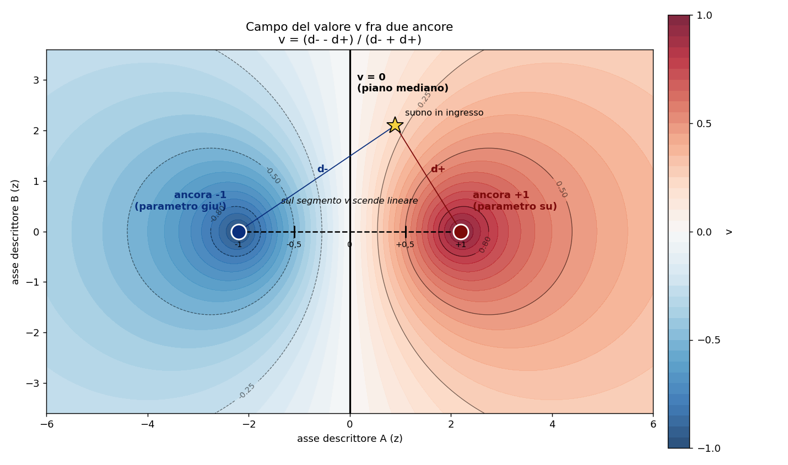

# Dispensa: mapping bipolare a ancore e distanza

Come ricavare dai descrittori un **unico valore con segno** da mandare a un
parametro, e come quel valore nasce dalla distanza fra il suono e due punti di
riferimento. Il prototipo offline e' `prova_ancore.py`.

## 1. Il problema

Si vuole un controllo che, da un solo ingresso audio, produca un numero `v` da
mandare a un parametro (volume, taglio di un filtro, quantita' di feedback). La
richiesta non e' "quanto e' acuto" o "quanto e' rumoroso", ma qualcosa di piu'
musicale: un valore **positivo su certi suoni e negativo su altri**, cosi' chi
suona sceglie quale gesto mandare per spingere il parametro su o per tirarlo
giu'. Serve quindi un valore con segno, gia' limitato fra -1 e +1, che dica
"verso quale dei due suoni di riferimento somiglia di piu' quello che sto
suonando adesso".

## 2. Il suono come punto in uno spazio

In ogni istante l'analisi misura i 16 descrittori. Quei 16 numeri, messi
insieme, sono le **coordinate di un punto** in uno spazio a 16 assi (un asse per
descrittore). Un frame di audio (una finestra di analisi) e' un punto; un suono
che evolve e' un punto che si muove nel tempo. Tutto il metodo lavora su questa
immagine: niente forme d'onda, solo posizioni di punti.

## 3. La normalizzazione (z-score) e perche' serve

I descrittori grezzi hanno scale incompatibili: il centroide vive sui migliaia
di Hz, la flatness sta sotto 1. Se misurassimo la distanza sui valori grezzi, a
decidere sarebbero solo i numeri grossi (centroide e rolloff), mentre flatness o
tpr non conterebbero nulla. La distanza diventerebbe di nascosto un misuratore
di brightness.

Per dare a ogni asse lo stesso peso si converte ogni descrittore in **z-score**:

    z = (grezzo - media) / deviazione

dove media e deviazione di ciascun descrittore sono **fissate una volta** dal
corpus (file `analisi/tabelle/segnali_sommario.csv`) e **mai ricalcolate dal
vivo**. Questo punto e' decisivo: se la taratura cambiasse durante la sessione,
le ancore si sposterebbero e lo stesso suono darebbe valori diversi a momenti
diversi. La media e la deviazione vanno congelate come una calibrazione di
fabbrica.

Lo z-score e' solo l'unita' di misura interna. Il punto si puo' leggere e
scrivere in grezzo (es. "flatness 0,85") oppure in z: sono lo stesso punto in
due scritture, come gradi Celsius e Fahrenheit. Si fissa in grezzo, la
matematica gira in z.

## 4. Le due ancore

Si scelgono due punti di riferimento nello spazio:

- **ancora +1**: il suono (o la posizione) che deve spingere il parametro **su**
- **ancora -1**: quello che deve tirarlo **giu'**

Un'ancora puo' essere:

1. un **suono reale** del corpus (si prendono i suoi 16 valori),
2. un **frame reale** di un brano (i 16 valori di quell'istante),
3. **coordinate scritte a mano** (es. "flatness alta e tpr bassa"); i descrittori
   non specificati restano alla media, cioe' a z = 0, posizione neutra.

In ogni caso l'ancora finisce per essere un punto con 16 coordinate in z.

## 5. Il calcolo del valore

Per il suono in ingresso (il suo punto `x`) si misurano due distanze:

- `d_piu`  = distanza di `x` dall'ancora +1
- `d_meno` = distanza di `x` dall'ancora -1

La distanza e' quella euclidea, calcolata in z sugli assi scelti:

    d(x, A) = radice( somma su ogni asse di (x_asse - A_asse)^2 )

Il valore con segno e':

    v = (d_meno - d_piu) / (d_meno + d_piu)

Si legge cosi': al numeratore "quanto sono piu' lontano dal -1 che dal +1"; al
denominatore la somma delle due distanze, che fa da normalizzatore. Non si
sottrae nessuna distanza assoluta: conta solo il **rapporto** fra le due.

### Proprieta' (perche' e' un buon controllo)

- Se `x` coincide con il +1, allora `d_piu = 0` e viene `v = +1`.
- Se `x` coincide con il -1, allora `d_meno = 0` e viene `v = -1`.
- Se `x` e' equidistante dalle due ancore, `d_piu = d_meno` e viene `v = 0`.
- **Sempre fra -1 e +1**, senza bisogno di normalizzare a valle: le due distanze
  sono non negative, quindi `|d_meno - d_piu|` non supera mai `d_meno + d_piu`.

### Esempio numerico (un asse)

Mettiamo un solo asse e lavoriamo in z. Ancora +1 a z = 2, ancora -1 a z = -2,
suono in ingresso a z = 1.

    d_piu  = |1 - 2|   = 1
    d_meno = |1 - (-2)| = 3
    v = (3 - 1) / (3 + 1) = 2 / 4 = +0,5

Il suono e' piu' vicino al +1, infatti `v` e' positivo ma non al massimo.

## 6. La geometria dei due punti

Capire la forma del campo `v` aiuta a posizionare le ancore con criterio.

Lo schema mostra il campo su due assi di esempio (in z): il colore e' `v` (blu
verso -1, rosso verso +1), le due ancore sono i cerchi pieni, il segmento
tratteggiato e' il righello lineare da +1 a -1, la linea nera spessa e' il piano
mediano (`v = 0`) e le curve sottili sono i luoghi a `v` costante. La stella e'
un suono in ingresso con le sue due distanze `d+` e `d-`.

### L'asse fra i due punti

Le due ancore definiscono una **retta** nello spazio (l'asse del controllo).

Sul **segmento** che le unisce, `v` e' un **righello lineare**: scivolando dal
+1 al -1 il valore scende dritto da +1 a -1, passando per 0 esattamente a meta'.
Su quel segmento il controllo e' regolare e prevedibile.

### Solo il rapporto, non la distanza assoluta

`v` dipende dal **rapporto** `d_meno / d_piu`, non da quanto sono grandi le
distanze. Allontanarsi da entrambe le ancore in egual misura non cambia `v`.
Tradotto: due suoni molto diversi in intensita' ma "nella stessa direzione"
rispetto alle ancore danno lo stesso `v`.

### Le superfici a `v` costante

Fuori dal segmento, i luoghi dove `v` resta costante (rapporto di distanze
costante) sono **superfici sferiche** (sfere di Apollonio) che avvolgono una
delle due ancore. Lo **zero** e' il caso del rapporto uguale a 1: e' il **piano
mediano** fra le due ancore (l'insieme dei punti equidistanti). Da una parte del
piano `v` e' positivo, dall'altra negativo.

### Il polo si tocca solo sull'ancora

`v = +1` si raggiunge **soltanto** sul punto +1, non oltre. Spostandosi dal +1
in qualsiasi direzione, anche proseguendo lungo l'asse oltre l'ancora, `v`
cala. L'ancora e' un picco isolato: questo spiega perche', applicando il metodo
a un brano, il frame scelto come ancora fa esattamente +1, ma i frame vicini (e
la versione lisciata) restano sotto.

### La distanza fra le ancore regola l'ampiezza

E' il parametro piu' importante da maneggiare.

- Ancore **lontane** fra loro: il passaggio da +1 a -1 e' graduale e copre una
  regione ampia dello spazio. Tanti suoni diversi prendono valori intermedi
  ben distinti. Corsa piena e morbida.
- Ancore **molto vicine**: quasi ogni suono e' grosso modo equidistante dalle
  due (`v` vicino a 0 quasi ovunque), e il valore scatta a +1 o -1 solo nello
  stretto spazio fra i due punti. Diventa un **interruttore a coltello**: poca
  corsa intermedia, ribaltamento brusco.

Quindi la separazione fra le ancore non e' un dettaglio: decide se il controllo
e' una manopola morbida o uno scatto.

## 7. La scelta degli assi

Non e' detto che convenga usare tutti e 16 i descrittori nella distanza.

Il corpus ha una **dimensione effettiva di circa 3,5**: i 16 descrittori non
sono 16 cose indipendenti. La sola brightness/rumorosita' (centroid, rolloff,
entropy, spread, irregularity che si muovono insieme) vale circa il **50
percento** della distanza. Usando tutti i 16 grezzi, il controllo diventa di
nascosto un misuratore di brightness e la tonalita' (tpr) finisce in minoranza.

Due strade:

1. **Pochi assi indipendenti**, scelti a mano (uno per ogni dimensione vera del
   suono): corsa ampia e leggibile su una qualita' chiara, ma i suoni che
   condividono quella qualita' si accavallano.
2. **Tutti i 16 ma sbiancati** (Mahalanobis): si scorrela lo spazio cosi' ogni
   dimensione conta una volta sola. Si distinguono quasi tutti i suoni, ma la
   corsa si accorcia (in molte dimensioni tutto sembra lontano) e serve piu'
   calcolo.

La scelta dipende dall'obiettivo: controllare una **qualita' netta** (pochi
assi) contro **distinguere quasi ogni suono** (16 sbiancati).

## 8. Estensioni

### Piu' ancore per polo

Un polo puo' essere fatto di piu' punti (es. 5 esempi per il +1 e 5 per il -1).
Due modi di combinarli:

- **minimo** (distanza dal piu' vicino del gruppo): ogni esempio del gruppo legge
  esattamente il polo. Significa "uno qualsiasi di questi cinque suoni spinge
  su". Adatto a poli fatti di esempi distinti.
- **media** (un polo = centro dei punti): zona morbida, ma i singoli esempi non
  toccano piu' gli estremi.

### Piu' parametri

Ogni parametro ha la sua coppia +1/-1. Lo stesso vettore di descrittori in
ingresso produce **N valori con segno in parallelo**: una superficie di
controllo a N dimensioni guidata da un solo ingresso audio. Punti diversi danno
curve diverse e indipendenti. Attenzione: se le ancore dei vari parametri
cadono nello stesso passaggio del brano (tipico della scelta per estremo
automatico), i parametri si muovono insieme; per indipendenza vera i punti vanno
messi a mano in zone diverse.

## 9. La lisciatura

Frame per frame `v` puo' essere nervoso: su un glissando, mentre la frequenza
scivola sui bin della FFT, tpr, flatness e n_peaks ballano e `v` sfarfalla. Per
il vivo serve una lisciatura a valle (media mobile o passa-basso). Il prezzo:
la lisciatura arrotonda i picchi, quindi un +1 toccato per un solo frame, dopo
la media, scende (un picco isolato circondato da vicini piu' bassi diventa
~+0,5). Compromesso noto: finestra corta = picchi pieni ma curva nervosa;
finestra lunga = curva calma ma picchi smussati.

## 10. Le quattro regole per posizionare le ancore

1. **Stesso mondo dei segnali in ingresso.** Ancore strumentali se si suonano
   strumenti. Con ancore sintetiche (sinusoide pura e rumore bianco) i gesti
   reali restano ammucchiati vicino a 0, lontani dai poli: poca corsa.
2. **Raggiungibili.** I punti vanno dove i suoni arrivano davvero, non in una
   zona vuota (es. "acuto e tonale insieme", combinazione che nessun suono
   realizza): li' il controllo resta morto a zero.
3. **Il piu' lontani possibile fra loro**, ma entrambi raggiungibili, per avere
   la corsa piena fra -1 e +1.
4. **Allineati al senso musicale** voluto: cosa deve spingere su e cosa giu'. E'
   questo a scegliere quali due suoni o quali coordinate fissare.

## 11. In Pure Data

L'implementazione dal vivo e' leggera, perche' tutto il peso sta nella scelta
delle ancore (fatta una volta), non nel calcolo. In astratto il giro e' questo:
memorizzare il vettore +1 e il vettore -1, a ogni frame convertire i descrittori
in ingresso in z con la taratura congelata, misurare le due distanze euclidee,
applicare `v = (d_meno - d_piu) / (d_meno + d_piu)`, lisciare, e per N parametri
ripetere lo stesso calcolo con le rispettive coppie di ancore. Sotto, come e'
realizzato.

### Il cuore: l'external `[ancore]`

Il calcolo sta in un external scritto in C (`pd-externals/monolitici`), nucleo
numerico puro (`ancore_core.h`) verificato contro `prova_ancore.py` a meno
dell'arrotondamento. Si crea con un argomento, il numero di parametri:
`[ancore 5]` tiene cinque coppie di ancore in parallelo. L'ingresso caldo e' la
lista dei 16 descrittori del frame corrente: ogni frame fa uscire la lista dei
`v`, uno per parametro.

**L'ordine dei 16 e' un contratto.** L'external legge i descrittori per
posizione, quindi vanno sempre nell'ordine di `DESCS` (centroid, spread,
rolloff, slope, obsir_std, flatness, crest, skewness, kurtosis, entropy, tpr,
n_peaks, tonality, flux, irregularity, zcr). Se a monte si raccolgono in un altro
ordine, `[ancore]` confronta un descrittore con la taratura di un altro.

**La taratura si manda all'avvio.** I due messaggi `media` e `dev` (i 16+16
numeri congelati dal corpus, il righello di cui alla sezione 3) si caricano da un
`loadbang` all'apertura della patch. Tutto cio' che non e' la taratura entra
grezzo e viene messo sullo stesso righello dentro l'external.

### Le ancore: l'abstraction `[ancora]`

Ogni ancora e' una istanza di `ancora.pd`, creata con polo e numero di parametro
come argomenti: `[ancora piu 0]` e' il +1 del parametro 0, `[ancora meno 0]` il
suo -1, e cosi' via per ogni coppia. L'abstraction fotografa un suono e lo manda
a `[ancore]` gia' formattato (`piu 0 <16 valori>`).

Il punto delicato del dal vivo e' **fotografare** un'ancora: non esiste un
`snapshot` per le liste di controllo (solo `snapshot~` per i segnali). La foto
si fa tenendo il frame in una memoria silenziosa (`list append`) e facendola
uscire a comando. L'ancora ha **tre sorgenti**, scelte da un selettore:

- `0`: il **frame singolo** dal vivo, fotografato nell'istante;
- `-1`: la **media recente** degli ultimi secondi suonati, piu' stabile del
  singolo frame (che puo' cogliere un istante ballerino);
- `1` e oltre: un suono preso dal **catalogo** (sotto).

Il selettore scatta subito, senza un bang separato: lo stesso numero sceglie la
sorgente e fissa l'ancora.

### La media recente: l'external `[ema]`

La media recente e' una media mobile esponenziale del frame,
`m += a*(x - m)` con `a = 1 - exp(-dt/tau)`. L'external `[ema]` misura il `dt`
reale fra i frame dall'orologio di Pd, quindi la costante di tempo `tau` e' in
**secondi** veri (piccola segue il momento, grande media lunga). E' anche la
lisciatura a valle di cui alla sezione 9: lo stesso meccanismo che stabilizza
un'ancora stabilizza il `v` in uscita. Si calcola una volta sola per tutto il
patch e si distribuisce a tutte le ancore.

### Il catalogo dei suoni

Le ancore si possono pescare da un catalogo di 64 suoni gia' analizzati (45
sintetici piu' i campioni ufficiali di clarinetto e timpano, questi presi sul
**frame centrale** di ogni campione, il cuore del suono). Due ruoli separati:

- `suoni.pd` e' il motore leggero che sta dentro ogni ancora: i 64 vettori in un
  solo messaggio, e l'indice estrae i 16 giusti;
- `catalogo.pd` e' un pannello unico da sfogliare, i 64 suoni con indice e nome,
  da cui si legge il numero da digitare.

Lo script `genera_suoni_pd.py` rigenera entrambi dai dati del corpus, cosi'
ampliare il catalogo non passa da Pd.

### Il collegamento: send e receive

Con l'external lontano dalle ancore i cavi sarebbero chilometrici, quindi due bus
con nome locale al patch (prefisso `$0-`, separati per istanza): uno porta il
frame dal vivo a tutte le ancore e all'external, l'altro raccoglie verso
`[ancore]` la taratura e le ancore configurate. L'interfaccia delle abstraction
resta a inlet e outlet, i `send`/`receive` stanno accanto a ogni blocco: i cavi
rimasti sono corti.

### Multi-parametro

Con `[ancore 5]` cinque parametri leggono lo stesso ingresso audio: dieci
istanze `[ancora]` (cinque coppie +1/-1), una lista di 5 `v` in uscita aperta da
`[unpack]`. E' la superficie di controllo a N dimensioni della sezione 8,
guidata da un solo ingresso.
